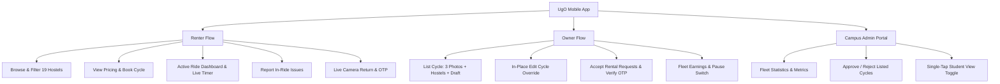

# UgO NITK Mobile Application - Comprehensive User Documentation & Feature Guide

Welcome to the official user documentation for the **UgO NITK Cycle Sharing Application**. UgO is a student-centric, peer-to-peer bicycle sharing platform engineered specifically for the **National Institute of Technology Karnataka (NITK), Surathkal** campus.

UgO NITK empowers students to rent cycles on demand across hostels, academic blocks, and campus facilities while allowing cycle owners to monetize unused bicycles securely and transparently.

---

## Architecture & Design Principles

- **Pure Daylight White Theme (`#FFFFFF`)**: Optimized for high-glare coastal sunlight across the Surathkal campus, ensuring maximum legibility with emerald green (`#10B981`) and deep slate (`#0F172A`) accents.
- **Zero Phone Exposure Privacy**: Peer-to-peer contact numbers are strictly masked across all UI screens. Coordination is handled via safe in-app communication.
- **Accountability & Integrity**: Mandatory live-camera-only verification prevents pre-recorded or falsified cycle return photos.
- **Campus Alignment**: Built-in validation matching official NITK campus hostels, pricing guidelines, and administrative verification.



---

## 1. Getting Started & Authentication

### 1.1 Landing Screen
When opening the UgO app or tapping the header brand logo, users are greeted with the clean UgO NITK Landing Screen. 

- **Key Information**: Highlighted NITK cycle sharing mission statement, quick feature cards (Instant Booking, Verified Cycles, Student Community), and quick action buttons.
- **Quick Action**: Tap **"Get Started →"** or **"Sign In"** to proceed directly into campus authentication.


### 1.2 Secure NITK Student Login & Registration
UgO restricts membership to verified students and faculty of NITK Surathkal.

- **College Domain Verification**: Requires an active institutional email address ending with `@nitk.edu.in`.
- **Password Visibility**: Eye icon toggle allows easy password verification without accidental typing errors.
- **Quick Fill for Testing**: Pre-fills active student credentials for rapid onboarding and testing.
- **Persistent Session**: Keeps the student authenticated securely across application restarts.


---

## 2. Cycle Discovery & Browsing Feed

### 2.1 Real-Time Cycle Feed
The home feed lists all bicycles currently available for rent across the campus in real time.

- **Header Controls**:
  - **UgO Brand Logo**: Single-tap return to the Welcome screen.
  - **Admin Switcher Chip**: Fast administrative access for authorized staff and student managers.
  - **Notification Bell**: Prominently situated at the top-right header with live unread badge counter.
- **Instant Search**: Type brand names (e.g., *Hero*, *Firefox*, *Btwin*), models, or specific hostel locations.
- **Cycle Cards**: Each card displays the primary photograph, verified cycle badge, pricing per hour (₹), pickup location, and instant **"View Details"** action.


### 2.2 Campus Filter System
Tapping the **"Filters"** icon opens an overlay that enables targeted searching:

| Filter Attribute | Supported Options |
|---|---|
| **Location** | Filter exclusively by the 19 official NITK hostels and campus landmarks. |
| **Cycle Condition** | `All`, `Excellent`, `Good`, `Average`. |
| **Cycle Type** | `All`, `Geared`, `Non-Geared`, `Mountain (MTB)`, `Hybrid`, `Road`. |
| **Price Ceiling** | Interactive slider from ₹5/hr up to ₹100/hr. |

---

## 3. Cycle Details & Fare Calculator

Selecting any cycle card from the feed opens the dedicated **Booking Detail Screen**.

### 3.1 Cycle Specifications
- **High-Resolution Gallery**: Multi-angle views uploaded by the verified cycle owner.
- **Specifications Matrix**: Details cycle condition, transmission type (Geared/Non-Geared), frame size, and precise current hostel location.

### 3.2 Dynamic Rental Duration & Pricing Stepper
- **Transparent Rates**: Clear hourly (e.g., ₹30/hr) and daily (e.g., ₹150/day) pricing tiers.
- **Interactive Duration Stepper**: Renter can increment or decrement rental hours using simple `+` / `-` controls.
- **Live Fare Calculator**: Instantly computes `Total Fare = Base Hourly Rate × Selected Hours` with zero hidden fees.
- **Instant Request**: Tapping **"Book Cycle Now"** dispatches a real-time rental request directly to the cycle owner.


---

## 4. Student Privacy & Campus Security

### 4.1 Zero Phone Exposure Policy
To prevent unsolicited calls, harassment, and privacy violations across peer students, UgO enforces a strict **Zero Direct Phone Exposure** standard:

- Personal mobile numbers are **never visible** in cycle cards, booking summaries, or owner profile views.
- Direct system phone dialer triggers (`tel:`) are replaced with an explicit privacy advisory:
  > *`🔒 MOBILE NUMBER: Hidden for privacy`*  
  > *"Student phone numbers and private credentials are protected. Please use in-app call or chat after booking."*

### 4.2 Cycle Owner Details Modal
Renters can tap **"View Details >"** next to the owner's card to inspect their verified identity:
- Verified Student Full Name
- Department / Year / Hostel
- Student Avatar / Profile Image
- Protected Contact Notice with safe in-app communication guidelines


---

## 5. Active Rentals & Live Ride Dashboard

When a booking is accepted by an owner, the rental shifts into the **Ongoing Rentals** tab.

### 5.1 Real-Time Ride Tracker
- **Active Ride Status**: Prominent emerald green badge confirms the ride is underway.
- **Live Elapsed Timer**: Real-time counter showing hours, minutes, and seconds elapsed since pickup.
- **Overdue Detection**: Automatically alerts the renter if the agreed rental window has been exceeded, showing additional accrued fare.
- **Safe In-App Communication**: Renter and owner can coordinate pickup and drop-off via built-in audio calling and messaging without sharing private phone numbers.


---

## 6. Campus Safety & In-Ride Issue Reporting

UgO NITK provides an immediate dispute and incident escalation system right from the active ride card.

### 6.1 Report Issue Modal
Clicking the **"⚠️ Report Issue"** button triggers an in-app reporting dialogue:

- **8 Standardized Violation Categories**:
  1. `Cycle Damaged / Flat Tyre`
  2. `Cycle Not at Stated Location`
  3. `Owner Unresponsive`
  4. `Overcharged / Payment Issue`
  5. `Lock / Key Malfunction`
  6. `Rude or Inappropriate Behavior`
  7. `Cycle Not as Described`
  8. `Other Campus Violation`
- **Detailed Description Field**: Accepts up to 1000 characters explaining the issue.
- **Campus Admin Action**: Reports are routed directly to the campus admin verification queue for resolution.


---

## 7. Cycle Return & Live Camera Verification

To ensure cycle accountability and prevent disputes regarding damages or improper parking, cycle returns require cryptographic and visual proof.

### 7.1 Mandatory Live Camera Capture
- **Gallery Upload Completely Disabled**: Users cannot select photos from their device camera roll or gallery.
- **Strict Camera Invocation**: Tapping **"Take Live Photo"** directly opens the device camera sensor.
- **Location & Condition Verification**:
  > *`🛡️ Live camera verification only. Gallery uploads are disabled to verify cycle location and condition in real-time.`*
- **Live Photo State**: When captured, a preview with a `✓ Live Photo Captured` badge appears, with an optional camera-only retake button.

### 7.2 Return OTP Generation & Sign-Off
- Once the live photo is taken, the renter taps **"Complete Return"**.
- A 4-digit **Return OTP** is generated on the renter's screen.
- The owner inspects the cycle in person, enters the OTP on their device, and confirms the return.


---

## 8. Notification Center & Action Cards

Accessed via the top-right bell icon on the home screen, the **Notification Center** keeps students updated on booking lifecycles.

### 8.1 Rental Request Management for Owners
- **Request Details**: Displays the renter's name, requested rental duration, total estimated payout, and the requested cycle.
- **Privacy Preservation**: Shows `🔒 Mobile: Protected for privacy`.
- **Owner Actions**:
  - **"Accept"**: Approves the booking and notifies the renter.
  - **"Reject"**: Declines the request and frees the cycle for other students.
  - **"View Renter Profile"**: Displays renter verified profile without disclosing phone numbers.

### 8.2 Bulk & Per-Card Actions
- **Mark All Read**: Clears all unread badges across cards.
- **Clear All**: Purges historical notification history.
- **Per-Card Delete**: Dedicated trash button on individual cards for clean notification management.


---

## 9. Cycle Listing & Campus Registration

Students who own a bicycle can list it on UgO in minutes via the **"List Cycle"** tab.

### 9.1 Multi-Photo Upload
- Requires 3 clear photographs: **Front View**, **Side Profile**, and **Lock / Gear Mechanism**.
- Photos are uploaded directly to secure cloud storage.

### 9.2 Cycle Specifications & Official NITK Hostel Selection
- **Brand & Model**: Text inputs for bicycle maker and model.
- **Standardized Cycle Condition Chips**:
  - `Excellent` (Like new, perfectly tuned gears and brakes)
  - `Good` (Minor cosmetic wear, fully functional)
  - `Average` (Usable campus commuter)
- **Cycle Type Chips**: `Non-Geared`, `Geared`, `Mountain Bike (MTB)`, `Hybrid`, `Road Bike`.
- **Official 19 NITK Hostels Picker**: Tapping the location selector opens a dedicated campus bottom sheet restricted strictly to official NITK residences:

```
[1] Block 1 (PG / PhD)       [8] Block 8 (Sahyadri)     [15] Mega Tower 2
[2] Block 2                  [9] PG Girls Hostel        [16] International Hostel
[3] Block 3                 [10] Alaknanda Girls         [17] Sports Complex
[4] Block 4                 [11] Sharavathi Girls        [18] Central Library
[5] Block 5                 [12] Brahma Boys             [19] Main Building / Pavillion
[6] Block 6                 [13] Ganga Girls
[7] Block 7                 [14] Mega Tower 1
```


### 9.3 Draft Persistence vs. Campus Publishing
Owners have two completion pathways at the bottom of the form:
- **`🔖 Save Draft`**: Stores the cycle with status `'draft'` without publishing it to the campus feed. Allows owners to complete photo uploads or details later.
- **`List My Cycle`**: Submits the cycle for verification and immediate listing on the live campus feed.


---

## 10. Managing & Editing Listed Cycles

### 10.1 Fleet Dashboard
Cycle owners can monitor their listings from the **"My Cycles"** tab:
- **Performance Banner**:
  - **Total Cycles**: Number of bicycles registered under the student's account.
  - **Active Listings**: Number of cycles currently visible in the campus search feed.
  - **Net Earnings**: Cumulative rental revenue earned.

### 10.2 In-Place Cycle Edit (Zero Duplicate Override)
- Tapping the **`✏️ Edit`** button opens the pre-populated cycle configuration.
- Saving updates executes an atomic database `.update()` using the cycle's unique ID.
- **No Duplicate Records**: Ensures cycle details are cleanly overridden without spawning duplicate entries in the database or feed.

### 10.3 Quick Visibility & Deletion Controls
- **Pause Toggle Switch**: Instantly pauses a cycle listing (e.g., when the owner needs their bicycle for classes) and restores it with a single tap.
- **Delete Action**: Permanently removes a cycle listing after completing all active rentals.


---

## 11. Campus Administration Portal

Authorized campus administrators and student committee heads have access to the **UgO Administration Dashboard** for managing campus-wide cycle operations, verifying listings, monitoring user safety, and enforcing community guidelines.

### 11.1 Fleet & Safety Analytics
- **Total Registered Users**: Verified student and faculty count across all hostels. Tapping this card automatically switches to the All Users tab.
- **Active Rides**: Current rides in motion across the campus.
- **Total Cycles**: Complete registered bicycle inventory.
- **Campus Disciplinary Alerts**: Flagged dispute and damage reports.

### 11.2 Verification Queue & Photo Carousel Auditing
- Review newly listed cycles submitted by student owners.
- High-fidelity image gallery: supports multi-photo carousel with photo counter (`X / Y 📸`), specs inspection (condition, brand, geared/non-geared), and pickup hostel location.
- Robust cloud image resolver guarantees reliable rendering across all mobile devices.
- One-tap cycle approval or rejection with reason notes sent directly to the owner.

### 11.3 Seamless Student View Switcher
- Administrators can instantly preview the student experience without logging out.
- The header contains a dedicated **`🚲 Student View`** chip that smoothly navigates straight into the student home feed.

### 11.4 Header Notification Bell & Live Alerts
- Campus administrators have a direct **Notification Bell** in the top header with a live unread badge counter.
- Tapping the bell opens the Notifications screen immediately to review incoming dispute escalations, fleet alerts, and administrative notices.


### 11.5 All Registered Users Directory & Search
- A dedicated **`👥 All Users`** tab displays every registered student and campus staff member.
- **Comprehensive Profile Cards**: Displays the user's full name, verified institutional email (`@nitk.edu.in`), assigned hostel residence, and system role (`Student` / `Admin`).
- **Real-Time Search Bar**: Instantly filter users by typing their name, email, or hostel without reloading.
- **Status Indicator**: Clear visual badges indicate whether an account is `Active` (green) or `Blocked` (red).


### 11.6 Disciplinary User Block & Unblock Controls
- To maintain campus trust and prevent policy violations (e.g. repeated bike damage, unauthorized transfers, or non-returns), administrators can block offending accounts directly.
- **Safety Confirmation Dialogue**: Tapping **`🚫 Block`** prompts an alert confirmation with the user's name to prevent accidental suspensions.
- **Instant Database Synchronization**: Modifies `profiles.is_blocked` in Supabase in real-time, instantly revoking booking and cycle listing privileges.
- **Reversible Action**: Tapping **`✅ Unblock`** immediately restores user account privileges once disciplinary matters are resolved.


---

## Summary of Feature Endpoints & Navigation Map

| Section | Target Screen Component | Key Capabilities |
|---|---|---|
| **Auth** | `AuthScreen.tsx` | `@nitk.edu.in` validation, password toggle, quick credentials fill. |
| **Welcome** | `LandingScreen.tsx` | Visual overview, Get Started CTA, direct link to login/feed. |
| **Explore** | `HomeScreen.tsx` | Feed of verified cycles, header Admin chip, live notification bell, search. |
| **Filter** | `FilterModal.tsx` | 19 hostels, conditions (`Excellent`, `Good`, `Average`), pricing range. |
| **Booking** | `BookingDetailScreen.tsx` | Multi-image preview, hourly/daily stepper, fare calculator, owner privacy modal. |
| **Ongoing** | `OngoingRentalsScreen.tsx` | Live ride timer, overdue calculator, in-app call/chat, issue report modal. |
| **Return** | `ReturnScreen.tsx` | **Live camera only** capture, gallery disabled, instant OTP generation. |
| **Alerts** | `NotificationsScreen.tsx` | Rental request accept/reject, mark all read, bulk clear, single-card delete. |
| **Listing** | `AddCycleScreen.tsx` | 3 photo slots, 19 NITK hostels picker, condition chips, Save Draft mode. |
| **Owner Hub** | `MyCyclesScreen.tsx` | Fleet earnings banner, in-place edit cycle override, pause listing switch. |
| **Admin** | `AdminDashboardScreen.tsx` | Fleet analytics, cycle verification carousel, `Student View` chip, header notification bell, user directory with search, block/unblock controls. |

---

*UgO NITK Mobile Application — Built for sustainable, student-driven campus mobility at NITK Surathkal.*

